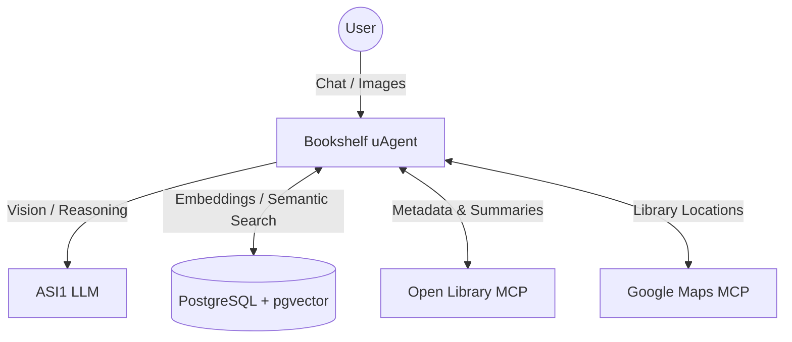

# Bookshelf Agent - Personal Literary Concierge

The Bookshelf Agent is a single-agent consumer utility designed to bridge the physical and digital literary worlds. It uses the ASI1-Agentic model and Fetch.ai uagents to identify books via vision, manage a persistent semantic memory (PostgreSQL + `pgvector`), and provide real-time local library availability via MCPs.

## Architecture



## Features
- **Multimodal Identification:** Identifies books (Title, Author, ISBN) from user-provided images.
- **Semantic Memory:** Maintains a persistent Read List and Wishlist, allowing semantic queries like "Find a book like the mystery I read last month".
- **Local Logistics:** Checks local libraries for availability using Google Maps MCP.
- **On-Demand PDF Reports:** Synthesizes reading data into a downloadable "Book Snapshot" PDF.

## Prerequisites

1. **Python 3.10+**
2. **PostgreSQL** with `pgvector` extension installed.
3. **Node.js / npm** (to run the MCP servers).
4. `.env` file with appropriate keys.

## Setup Instructions

### 1. Database Setup
Ensure PostgreSQL is running and you have created a database (e.g., `bookshelf`).
Install `pgvector` for your PostgreSQL instance (e.g., `brew install pgvector` on macOS or via Docker).
Run the initialization script:
```bash
psql -U your_user -d bookshelf -f init_db.sql
```

### 2. Environment Variables
Create a `.env` file based on the provided `.env.example`:
```ini
ASI1_API_KEY=your_asi1_key
DB_HOST=localhost
DB_PORT=5432
DB_NAME=bookshelf
DB_USER=your_user
DB_PASSWORD=your_password
AGENT_SEED_PHRASE=your_agent_seed_phrase
GOOGLE_MAPS_API_KEY=your_google_maps_key
```

### 3. Install Dependencies
```bash
pip install -r requirements.txt
```

### 4. Running the Agent
The agent automatically handles spawning the MCP servers locally via `npx` when it runs. Ensure `npx` is available in your PATH.
```bash
python agent.py
```

## Manual Wipe

For privacy, all data is retained persistently. However, you can completely wipe the persistent memory (TRUNCATE the tables) using the built-in PostgreSQL procedure.

To wipe the database manually from the PostgreSQL CLI:
```sql
CALL manual_wipe();
```
Alternatively, you can ask the agent in chat: `"Manual Wipe my data"`, and the agent will execute this command.
